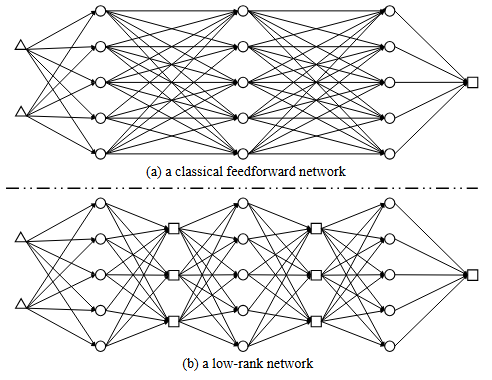
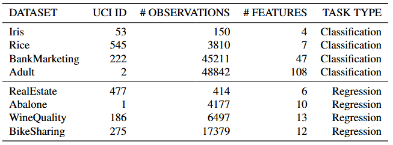
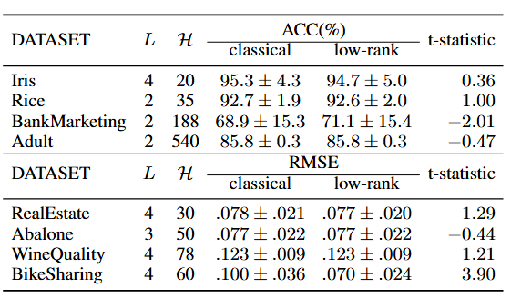

# LowRankUAT

This repo is the official implementation of ["Approximation to Smooth Functions by Low-Rank Swish Networks"](https://proceedings.mlr.press/v267/li25bb.html), which has been accepted at the International Conference on Machine Learning (ICML) 2025.


## Introduction

In this paper, we establish the theoretical foundation for low-rank compression from the perspective of universal approximation theory. Specifically, we prove that for any Hölder function, there exists a Swish network with narrow linear hidden layers sandwiched between adjacent nonlinear layers, which can approximate the Hölder function within a given small error. Through our constructive approximation, we find that the width of the linear hidden layers is at most one-third of that of the nonlinear layers. This leads to a significant reduction: the number of multiplication operations occurring in all hidden layers except the first one can be decreased by at least one-third compared with a classical feedforward network having the same depth and width of nonlinear layers. Extensive experiments have confirmed the reliability of our theoretical result. This research not only enriches the theoretical understanding of low-rank compression but also holds great potential for practical applications where computational efficiency is crucial.



**Figure 1. An illustration of the difference between classical feedforward network and low-rank network.**

## How to Run the Code

1. The file util.py contains the code for loading and preprocessing the data and the code of neural network.
2. The code files for running experiments on classifiation tasks and regression tasks are separate.
3. Take classification tasks for example. You should first run gs_cls.py to select the optimal hyper-parameter, then run cv_cls.py to evaluate the performance.
4. For regression tasks, please run gs_reg.py and cv_reg.py .

## Experimental Results

We choose eight popular UCI datasets, four of which are used for classification tasks and four for regression tasks. For each dataset, we convert each category feature to several dummy features, then scale all features to $[0, 1]$. For regression datasets, we also scale the targets to $[0, 1]$. Table 1 records the basic information for these datasets. Then, for each dataset, we employ grid search with $10$-fold cross-validation to identify the optimal depth and width for the classical feedforward Swish network. The candidate set for the depth consists of $\{2, 3, 4\}$, and for the width, it is $\{4d, 5d, 6d\}$, where $d$ represents the input dimension. Subsequently, we conduct $10$-fold cross-validation to evaluate the classical feedforward Swish network of the optimal depth and width and the low-rank Swish network whose depth and width of nonlinear layers are the same as those of the classical feedforward Swish network and width of linear hidden layers is one-third of that of nonlinear layers. In addition, we perform dependent t-tests for paired samples on the cross-validation results. 

**Table 1. Basic information about UCI datasets used in experiments.**




The results of t-tests in Table 2 indicate that on all datasets, classical feedforward Swish networks do not significantly outperform low-rank Swish networks. Conversely, on the BikeSharing dataset, the root mean square error (RMSE) of the classical feedforward Swish network is significantly higher than that of the low-rank Swish network. The experimental results indicate that the compression ratio of $1/3$ suggested by our main theorem is reliable.

**Table 2. Cross-validation results. $L$ represents the depth and $\mathcal{H}$ represents the width of nonlinear layers.**




## How to Cite

```
@InProceedings{li25approximation,
  title = {Approximation to Smooth Functions by Low-Rank Swish Networks},
  author = {Li, Zimeng and Li, Hongjun and Wang, Jingyuan and Tang, Ke},
  booktitle = {Proceedings of the 42nd International Conference on Machine Learning},
  pages = {35259--35291},
  year = {2025},
  volume = {267},
}
```


## Contact information

For help or issues, please submit a GitHub issue.

For personal communication related to this work, please contact Zimeng Li (`zimeng.dannis.li@outlook.com`).


